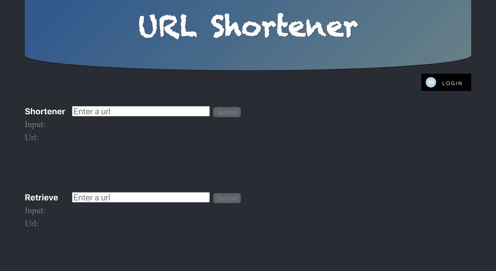
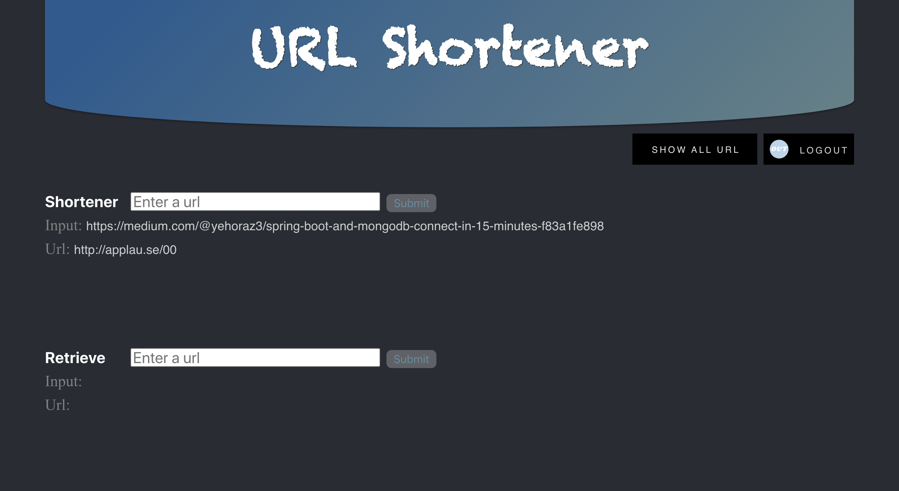
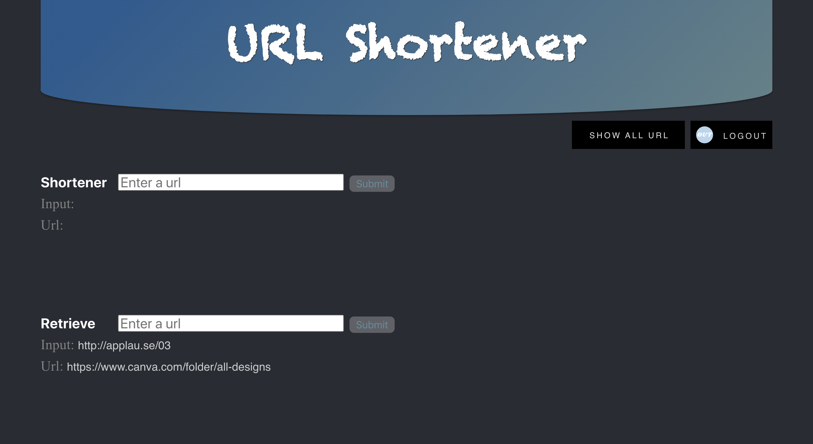
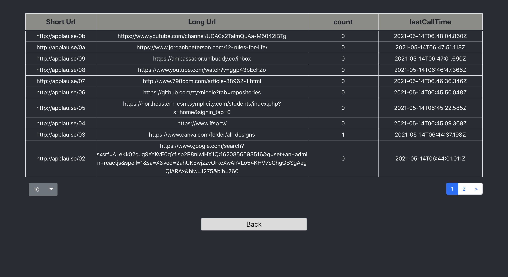
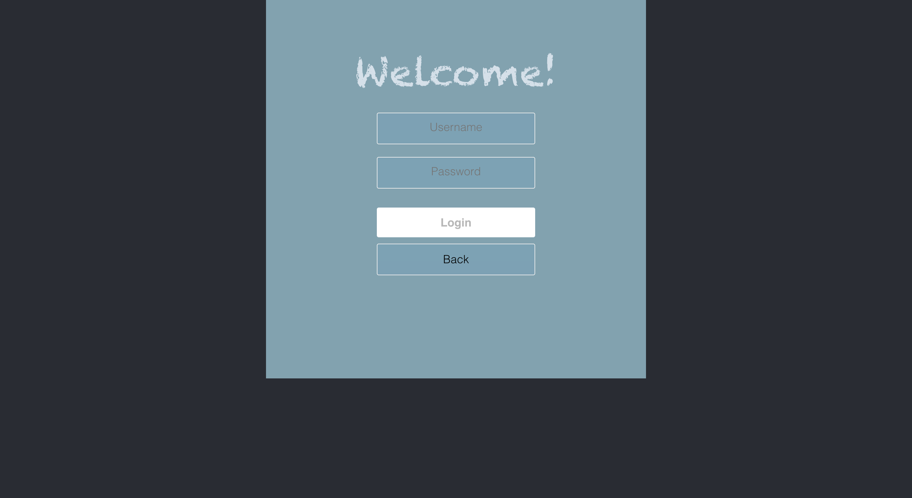

# Url Shortener

 A demo web app to shorten and retrieve url

## How to start

### Start the server
```
$ cd server
$ ./mvnw spring-boot:run
```

### Start the web
```
$ cd web
$ npm install
$ npm start
```

## How to use

-  To shorten a url, please start with `http://` or `https://`
-  To retrieve the original url, please enter the short url in the input area
-  To see all records, login as admin, please use username: `admin`, password: `password`


## Demo

Below are the screenshot for preview the app

1. Main page (before log in)



2. Main page (after log in)


3. Shorten URL



4. Retrieve URL



5. Dump all URL lists



6.Login page




## Framework
-  Fornt End: React JS
-  Back End: Springboot


